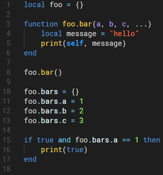
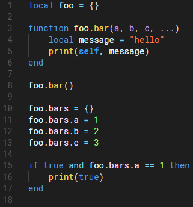

# Lua Plus v1.1.1

This extension improves the native Lua syntax found in Visual Studio Code. The following are a few examples of what scope names were added:

- `entity.name.function-table.lua` on tables of function definitions, ie: `function (foo).bar()`
- `variable.parameter.rest.lua` on rest parameter ellipses on functions, ie: `function foo(...)`
- `variable.other.table.property.lua` on variable properties, ie: `foo.(bar)`

It also fixes inconsistent variable and function scoping and attempts to follow TextMate language grammar naming conventions more closely than the native syntax. This was based on [rorydriscoll/LuaSublime](https://github.com/rorydriscoll/LuaSublime). This extension does not include IntelliSense for Lua. I may plan to add it in the future but for now, you can install other extensions that include this functionality.

## Before:

## After:
